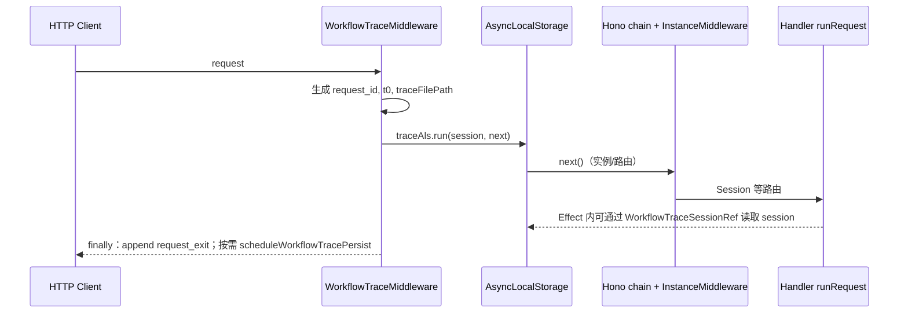

# 2026-04-29 — Workflow trace 完整文档（归档）

本文合并 **端到端流程说明** 与 **2026-04-28 里程碑** 中的能力摘要、事故备忘、环境变量与设计反思；后续以此目录为 workflow trace 文档的 **canonical** 入口。

---

## 概要

OpenCode 服务端 HTTP 工作流中的 **workflow trace**：按请求生成结构化 JSON（`format: opencode-trace-v2`），便于排查会话、模型流与耗时。

### 主要能力

- **落盘位置**：与日志同级，例如 `~/.local/share/opencode/trace/`（随 `Global.Path.trace`）。
- **文件命名**：`trace_<request_id>_<iso-timestamp>.json`，**一 HTTP 请求至多一个 trace 文件**。
- **内容**：
  - HTTP 元数据、`events` 时间线（`opencode.<business>.<method>=<ms>|k=v`）。
  - **`chat`**：`user_input`、`model_stream_text`、`part_deltas`（与 UI `message.part.delta` 粒度一致）、`assistant_output`、`model`、TTFT 等。
- **Effect 贯通**：`WorkflowTraceSessionRef` 将 trace session 传入 `AppRuntime.runPromise`（ALS 无法穿透 Effect）。
- **`prompt_async`**：204 返回后 prompt 仍在后台执行，trace **推迟到 `runRequest.finally`** 再持久化，避免仅有 `user_input`、无模型回复。
- **性能**：流式路径禁止对 growing string 反复 `+=`（见 [`WORKFLOW-TRACE-PERF.md`](../../WORKFLOW-TRACE-PERF.md)）；持久化经 `setImmediate` 异步调度。
- **默认范围**：仅 `POST /session/:id/message|prompt_async|command|shell` 写 trace；`OPENCODE_WORKFLOW_TRACE=all` 或请求头 `x-opencode-workflow-trace: 1` 可扩大范围。

---

## 1. 何时生成 Trace

Trace **按 HTTP 请求**创建：**满足「要写 trace」的请求 → 至多一个 trace 文件**。

判定逻辑见 [`workflow-trace.ts`](../../packages/opencode/src/server/workflow-trace.ts) 中的 `shouldEmitTraceFile` / `shouldSkip`：

| 条件 | 行为 |
|------|------|
| `OPTIONS`，或路径为 `/log`、`/event*`、`/global/event*` | 不写 trace |
| 请求头 `x-opencode-workflow-trace: 1`（或等价），或环境变量 `OPENCODE_WORKFLOW_TRACE` 为 `all` / `1` / `true` | 对未跳过的路由写 trace |
| 默认（上述均未启用） | 仅 **`POST`** 且路径匹配 `/session/:id/message`、`prompt_async`、`command`、`shell` 时写 trace |

响应中会带上 **`X-OpenCode-Trace-Id`**（即本次 `request_id`），便于与日志或客户端对齐。

---

## 2. 请求生命周期（ALS + 中间件）

- **`WorkflowTraceMiddleware`**（[`server.ts`](../../packages/opencode/src/server/server.ts) 挂载）：创建 `WorkflowTraceSession`，填入 `http`、`opencode.directory/workspace`，写入首条 HTTP trace 事件，并在 **`traceAls`** 中执行后续中间件与路由。
- **`InstanceMiddleware`**（[`middleware.ts`](../../packages/opencode/src/server/routes/instance/middleware.ts)）：在同一 ALS 上下文中追加 `instance.resolve_directory`、`workspace.enter`、`route.enter` / `route.exit` 等 **`traceStep`** 行。
- **ALS 无法传入 Effect**：会话处理器通过 **`WorkflowTraceSessionRef`**（[`workflow-trace.ts`](../../packages/opencode/src/server/workflow-trace.ts)）把同一指针注入 `AppRuntime.runPromise`，便于在 `SessionPrompt` / `SessionProcessor` 内 `yield* WorkflowTraceSessionRef`。

---

## 3. HTTP Handler 与 Span

会话相关路由使用 **`runRequest`**（[`routes/instance/trace.ts`](../../packages/opencode/src/server/routes/instance/trace.ts)）：

- 在进入 Effect **之前**用 **`getWorkflowTraceSession()`** 取 ALS 中的 session（同步边界）。
- 写入 `handler.run_request.schedule`，管道末尾 **`handler.run_request.ok`** / **`handler.run_request.fail`**。
- **`Effect.provideService(WorkflowTraceSessionRef, session)`**：保证 Effect 栈内 trace 可用。

---

## 4. `chat` 字段如何写入

以下为 **`chat`** 区块与调用点的对应关系（均在 [`workflow-trace.ts`](../../packages/opencode/src/server/workflow-trace.ts)）。

### 4.1 用户侧：`traceChatInitFromUserMessage`

在 **`SessionPrompt.prompt`** 创建用户消息之后（[`prompt.ts`](../../packages/opencode/src/session/prompt.ts)）：

- 设置 `session_id`、`user_message_id`、`model`
- **`user_input`**：由 **`summarizePromptPartsForTrace`** 汇总文本与 `[file:…]` 占位（不落原始文件字节）

### 4.2 模型流：`traceRecordLlmStreamEvent` + `appendModelStreamText`

在 **`SessionProcessor`** 对流事件的 **`handleEvent`** 开头（[`processor.ts`](../../packages/opencode/src/session/processor.ts)）：

- **`text-delta` / `reasoning-delta`**：记录 TTFT（`ttft_stream_ms`、`ttft_stream_kind`；首段用户可见正文另记 `ttft_ms`），正文增量写入内部的 **`_modelStreamChunks`**。
- **`start`**：重置内部 stream 缓冲（新一轮）。

持久化前 **`scheduleWorkflowTracePersist`** 会 **`materializeModelStreamText`**，写出 **`model_stream_text`**。

### 4.3 UI 对齐：`traceRecordMessagePartDelta` → `part_deltas`

紧跟 **`session.updatePartDelta`**：

- **reasoning-delta**：reasoning part 的 `field: "text"` 增量。
- **text-delta**：正文 text part。

每条 **`part_deltas`** 元素对应一次 **`message.part.delta`**；**同一 `part_id` 在多行重复表示同一内容块的多段流式增量**。

### 4.4 收尾：`traceChatFinalizeAssistant`

在 **`SessionProcessor.cleanup`** 中，根据 **`traceAssistantText`** 写入 **`assistant_output`**（多轮工具循环用分隔符合并）。

---

## 5. `prompt_async`：推迟落盘

**`POST …/prompt_async`** 先 **204**，Prompt Effect 仍在后台。若在中间件 **`finally`** 立即持久化，文件中往往只有 **`user_input`**。

- **`workflowTracePathDefersPersist(pathname)`** 为 true 时，中间件 **不** 在 `finally` 里持久化。
- 路由在 **`runRequest(…).finally()`**（[`session.ts`](../../packages/opencode/src/server/routes/instance/session.ts)）于 Effect **结束后**再 **`scheduleWorkflowTracePersist`**。

---

## 6. 持久化：`scheduleWorkflowTracePersist`

- **`setImmediate`** 异步执行，避免阻塞 HTTP 收尾。
- **`materializeModelStreamText`**、组装 **`events`**、`http.status`、`chat`、`error`，然后 **`JSON.stringify`** + **`fs.writeFile`**。
- 目录：**`Global.Path.trace`**（[`packages/core/src/global.ts`](../../packages/core/src/global.ts)）。

---

## 7. Trace JSON 顶层结构（摘要）

| 字段 | 含义 |
|------|------|
| `format` | 固定 `opencode-trace-v2` |
| `request_id` | 与响应头 `X-OpenCode-Trace-Id` 一致 |
| `started_at` / `finished_at` / `duration_ms` | 请求时间窗口 |
| `trace_file` | 落盘绝对路径 |
| `http` | method、path、url、status |
| `opencode` | directory、workspace 等 |
| `events` | 字符串数组：`opencode.<business>.<method>=<ms>[|k=v,...]` |
| `chat` | 可选；会话与用户输入、流式回放、TTFT、`part_deltas` 等 |
| `error` | 可选；中间件捕获的异常信息 |

---

## 8. 源码索引

| 职责 | 文件 |
|------|------|
| 中间件、ALS、`scheduleWorkflowTracePersist` | [`packages/opencode/src/server/workflow-trace.ts`](../../packages/opencode/src/server/workflow-trace.ts) |
| `runRequest`、`WorkflowTraceSessionRef` | [`packages/opencode/src/server/routes/instance/trace.ts`](../../packages/opencode/src/server/routes/instance/trace.ts) |
| `prompt_async` 推迟持久化 | [`packages/opencode/src/server/routes/instance/session.ts`](../../packages/opencode/src/server/routes/instance/session.ts) |
| `traceChatInitFromUserMessage` | [`packages/opencode/src/session/prompt.ts`](../../packages/opencode/src/session/prompt.ts) |
| `traceRecord*`、`traceChatFinalizeAssistant` | [`packages/opencode/src/session/processor.ts`](../../packages/opencode/src/session/processor.ts) |
| 挂载 WorkflowTraceMiddleware | [`packages/opencode/src/server/server.ts`](../../packages/opencode/src/server/server.ts) |
| `Path.trace` | [`packages/core/src/global.ts`](../../packages/core/src/global.ts) |

---

## 9. 事故与备忘

根目录 [**`WORKFLOW-TRACE-PERF.md`](../../WORKFLOW-TRACE-PERF.md)**：流式 trace 字符串拼接导致卡顿的根因与自检清单。

---

## 10. 里程碑反思（2026-04-28）

先按 SDK `fullStream` 逐事件落盘（`llm_stream` / `stream_packages`），后与 **UI / bus** 粒度不一致、排查对不上号，且加重热路径。收敛为 **`part_deltas`**（与 `session.updatePartDelta` / `message.part.delta` 一一对应）后，trace 才与用户所见一致。

**原则：** 观测与产品同构；热路径先量后加；少即是多（避免两套语义相近的流）。

**可选后续：** 采样/开关细化、隐私与体积平衡、与外部 trace id / 导出格式统一。

---

## 11. 环境变量（节选）

| 变量 | 含义 |
|------|------|
| `OPENCODE_WORKFLOW_TRACE` | `all` / `1`：对所有未跳过路由写 trace |
| `OPENCODE_TRACE_MAX_USER_CHARS` | `user_input` 上限 |
| `OPENCODE_TRACE_MAX_STREAM_CHARS` | `model_stream_text` 上限 |
| `OPENCODE_TRACE_MAX_ASSISTANT_CHARS` | `assistant_output` 上限 |
| `OPENCODE_TRACE_MAX_PART_DELTAS` | `part_deltas` 最大条数 |
| `OPENCODE_TRACE_PART_DELTA_CAP` | 单条 `part_deltas[].delta` 字符上限 |

---

*维护约定：workflow trace 流程或字段有重大变更时，请优先更新 **本文件**。*
