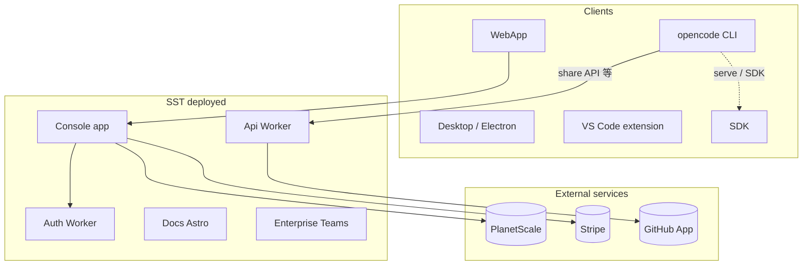
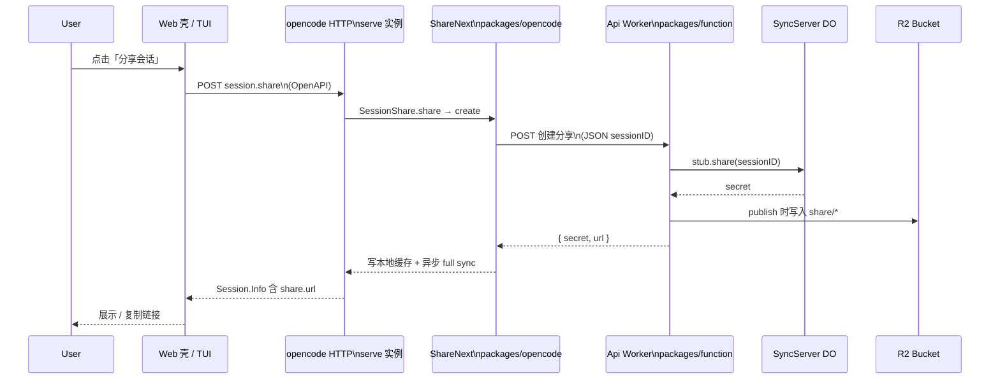

# OpenCode 功能地图（代码锚点）

本文为仓库内各业务能力与**源码位置**的对照，便于从「能力」跳到实现。内容基于当前仓库快照；若接口重命名，请以实际文件为准。

全文顺序：**§A**（含 **§A.4～A.5** 单轮图与实测路径）架构与域名、**§B** 子业务一览表 → **§1–§8** 分模块代码锚点。

各节在代码块前附有 **Source** 行：链接为自本文件（`docs/opencode-function-map.md`）出发的 **相对路径**（`../...`），指向仓库根下的源文件，并标注行号范围，便于在 IDE 或支持相对链接的 Markdown 预览中跳转审阅。

---

## A. 架构结构（Architectural structure）

本节从 **部署拓扑 + 仓库分层 + 域名约定** 三面对齐视图；以下为「系统长什么样」，后文 `#1`–`#8` 为「每一块怎么落代码」。

### A.1 运行时拓扑（一页图）

以下为逻辑关系：**终端/桌面/SDK** 可走本地运行时；**SST（Cloudflare 为主）** 承载对外站点与网关；**PlanetScale** 控制台关系型数据；**Stripe** 商业；**SQLite**（见 CLI）为客户端本地会话存储。



**审阅：** 部署单元定义见 [`infra/app.ts`](../infra/app.ts)、[`infra/console.ts`](../infra/console.ts)、[`infra/enterprise.ts`](../infra/enterprise.ts)；总成入口见 **`sst.config.ts`（文末 §1）**。

### A.2 域名与 Stage（环境与 URL 后缀）

同一套 infra 在不同 `$app.stage` 下挂载不同 **`domain`** / **`shortDomain`**（控制台主域、文档、Api、Teams 短域名等均由此推导）。

**Source:** [`infra/stage.ts`](../infra/stage.ts) · Lines **1–19**

```1:19:/Users/groot/myfile/backend/opencode/infra/stage.ts
export const domain = (() => {
  if ($app.stage === "production") return "opencode.ai"
  if ($app.stage === "dev") return "dev.opencode.ai"
  return `${$app.stage}.dev.opencode.ai`
})()

export const zoneID = "430ba34c138cfb5360826c4909f99be8"

new cloudflare.RegionalHostname("RegionalHostname", {
  hostname: domain,
  regionKey: "us",
  zoneId: zoneID,
})

export const shortDomain = (() => {
  if ($app.stage === "production") return "opncd.ai"
  if ($app.stage === "dev") return "dev.opncd.ai"
  return `${$app.stage}.dev.opncd.ai`
})()
```

### A.3 仓库与工作区骨架（packages）

根 **`package.json` `workspaces`** 声明 Bun monorepo 包范围（含 `packages/*`、`packages/console/*`、sdk、slack）。

**Source:** [`package.json`](../package.json) · Lines **8–31**

```8:31:/Users/groot/myfile/backend/opencode/package.json
  "scripts": {
    "build": "bun run --cwd packages/opencode build",
    "build:fast": "bun run --cwd packages/opencode build -- --single --skip-embed-web-ui",
    "build:web": "bash scripts/build-and-web.sh",
    "dev": "bun run --cwd packages/opencode --conditions=browser src/index.ts",
    "dev:desktop": "bun --cwd packages/desktop-electron dev",
    "dev:web": "bun --cwd packages/app dev",
    "dev:console": "ulimit -n 10240 2>/dev/null; bun run --cwd packages/console/app dev",
    "dev:storybook": "bun --cwd packages/storybook storybook",
    ...
  },
  "workspaces": {
    "packages": [
      "packages/*",
      "packages/console/*",
      "packages/sdk/js",
      "packages/slack"
    ],
```

**Source（根脚本与包对应关系摘要）：** 同上文件 Lines **8–24**；核心产品包落位见本文 **§B** 表。

### A.4 单轮往返架构图（一页：谁在一条请求链上）

以下为 **一次端到端业务能力**（以「会话可分享链接」为主线）的单轮拓扑：先经 **本机运行的 opencode Serve / SDK**，再由 **ShareNext** 访问云端 **Api Worker**，在 **SyncServer DO** 上落密钥与会话 id，最后把 **公开预览 URL** 回传给 UI。不包含 Zen 计费第二跳。



**审阅（链路边界）：** 入站 API 定义 [`packages/opencode/src/server/routes/instance/session.ts`](../packages/opencode/src/server/routes/instance/session.ts)（`session.share`）；出站与队列 [`packages/opencode/src/share/share-next.ts`](../packages/opencode/src/share/share-next.ts)；云端 [`packages/function/src/api.ts`](../packages/function/src/api.ts)（`POST /share_create` 与 `SyncServer`）。

### A.5 实例：一次「创建分享链接」在代码里怎么走

下面用一个 **真实链路**说明 **单轮**：Web 静态壳在用户点击「分享」时调用本地 SDK → 本地服务端点 `session.share` → `ShareNext.create` 向配置好的 `baseUrl` 发起 `POST …/api/share`（无组织登录时的 legacy）或控制台 `POST …/api/shares`；**云上**与本仓库对齐的 Worker 入口在源码里实现为 **`POST /share_create`**（产品边缘若存在路径改写，`ShareNext` 侧仍以测试与配置中的 **`/api/share` / `/api/shares`** 为准，见 **`share-next.test.ts`**）。

1. **UI → 本地服务端（OpenAPI `session.share`）**

**Source:** [`packages/app/src/pages/session/use-session-commands.tsx`](../packages/app/src/pages/session/use-session-commands.tsx) · Lines **175–188**

```175:188:/Users/groot/myfile/backend/opencode/packages/app/src/pages/session/use-session-commands.tsx
    const url = await sdk.client.session
      .share({ sessionID })
      .then((res) => res.data?.share?.url)
      .catch(() => undefined)
```

**Source:** [`packages/opencode/src/server/routes/instance/session.ts`](../packages/opencode/src/server/routes/instance/session.ts) · Lines **446–478**

```446:478:/Users/groot/myfile/backend/opencode/packages/opencode/src/server/routes/instance/session.ts
    .post(
      "/:sessionID/share",
      describeRoute({
        summary: "Share session",
        description: "Create a shareable link for a session, allowing others to view the conversation.",
        operationId: "session.share",
        responses: {
          200: {
            description: "Successfully shared session",
            content: {
              "application/json": {
                schema: resolver(Session.Info.zod),
              },
            },
          },
          ...errors(400, 404),
        },
      }),
      validator(
        "param",
        z.object({
          sessionID: SessionID.zod,
        }),
      ),
      async (c) =>
        jsonRequest("SessionRoutes.share", c, function* () {
          const sessionID = c.req.valid("param").sessionID
          const share = yield* SessionShare.Service
          const session = yield* Session.Service
          yield* share.share(sessionID)
          return yield* session.get(sessionID)
        }),
    )
```

2. **`ShareNext.create`：按账号状态选择 outbound `baseUrl` + path，并对云端 `POST JSON { sessionID }`**

**Source:** [`packages/opencode/src/share/share-next.ts`](../packages/opencode/src/share/share-next.ts) · Lines **210–226**, **307–316**

```210:226:/Users/groot/myfile/backend/opencode/packages/opencode/src/share/share-next.ts
    const request = Effect.fn("ShareNext.request")(function* () {
      const headers: Record<string, string> = {}
      const active = yield* account.active()
      if (Option.isNone(active) || !active.value.active_org_id) {
        const baseUrl = (yield* cfg.get()).enterprise?.url ?? "https://opncd.ai"
        return { headers, api: legacyApi, baseUrl } satisfies Req
      }

      const token = yield* account.token(active.value.id)
      if (Option.isNone(token)) {
        throw new Error("No active account token available for sharing")
      }

      headers.authorization = `Bearer ${token.value}`
      headers["x-org-id"] = active.value.active_org_id
      return { headers, api: consoleApi, baseUrl: active.value.url } satisfies Req
    })
```

```307:316:/Users/groot/myfile/backend/opencode/packages/opencode/src/share/share-next.ts
    const create = Effect.fn("ShareNext.create")(function* (sessionID: SessionID) {
      if (disabled) return { id: "", url: "", secret: "" }
      log.info("creating share", { sessionID })
      const req = yield* request()
      const result = yield* HttpClientRequest.post(`${req.baseUrl}${req.api.create}`).pipe(
        HttpClientRequest.setHeaders(req.headers),
        HttpClientRequest.bodyJson({ sessionID }),
        Effect.flatMap((r) => httpOk.execute(r)),
        Effect.flatMap(HttpClientResponse.schemaBodyJson(ShareSchema)),
      )
```

路径前缀定义见同文件 **`legacyApi` / `consoleApi`**（约 **91–92** 行）：`/api/share` 与 `/api/shares`。契约单测：**Source:** [`packages/opencode/test/share/share-next.test.ts`](../packages/opencode/test/share/share-next.test.ts) · Lines **100–136**。

3. **云端 Api Worker：`POST /share_create` → Durable Object，返回预览页 URL**

**Source:** [`packages/function/src/api.ts`](../packages/function/src/api.ts) · Lines **116–129**

```116:129:/Users/groot/myfile/backend/opencode/packages/function/src/api.ts
export default new Hono<{ Bindings: Env }>()
  .get("/", (c) => c.text("Hello, world!"))
  .post("/share_create", async (c) => {
    const body = await c.req.json<{ sessionID: string }>()
    const sessionID = body.sessionID
    const short = SyncServer.shortName(sessionID)
    const id = c.env.SYNC_SERVER.idFromName(short)
    const stub = c.env.SYNC_SERVER.get(id)
    const secret = await stub.share(sessionID)
    return c.json({
      secret,
      url: `https://${c.env.WEB_DOMAIN}/s/${short}`,
    })
  })
```

**语义小结：** 单轮里 **用户只看到「请求分享 → 得到 URL」**；中间经过 **本地 HTTP 会话层**、`ShareNext` 的出站 HTTP，以及云上 **Worker + DO**。后续消息同步走 **`flush`/`share_sync`** 等路径，同一文档 **§5** 可查。

---

## B. 子业务功能清单（Sub business functions）

下表按 **业务域 → 子能力点 → 主要实现/部署位置** 列出，便于与后文 **§1–§8** 及目录树交叉对照；**未穷举**每个 HTTP 路由或子命令 flag，细节以对应 `Source` 文件为准。

| 业务域 | 子能力点 | 主要位置（审阅） |
|--------|----------|------------------|
| **本地 CLI 产品** | 顶层命令注册（run / mcp / serve / web / github / session / …） | [`packages/opencode/src/index.ts`](../packages/opencode/src/index.ts) |
| | `debug` 子树（config、lsp、snapshot、wait…） | [`packages/opencode/src/cli/cmd/debug/index.ts`](../packages/opencode/src/cli/cmd/debug/index.ts) |
| | 本地 DB 迁移、SQLite 存储 | 同 `index.ts` middleware；存储实现于 `packages/opencode` 下 `storage/`（未在本篇展开） |
| | 插件 `plug` | [`packages/opencode/src/cli/cmd/plug.ts`](../packages/opencode/src/cli/cmd/plug.ts) |
| | 构建后启动本地 Web：`build:web` | [`scripts/build-and-web.sh`](../scripts/build-and-web.sh) |
| **对外 API（Api Worker）** | 会话分享：创建/删除/同步、WS `share_poll`、读 `share_data` | [`packages/function/src/api.ts`](../packages/function/src/api.ts)（`SyncServer` + Hono） |
| | GitHub App：Actions OIDC / PAT 换 installation token、查 installation | 同上 **130–388** 行段 |
| | 飞书事件 → Discord 转发 | 同上 `/feishu` |
| **控制台 SaaS** | PlanetScale 分支、DB 密码、Drizzle 侧 | [`infra/console.ts`](../infra/console.ts)（数据库段） |
| | OAuth / 登录：`auth.<domain>` | [`packages/console/function/src/auth.ts`](../packages/console/function/src/auth.ts)（Infra 引用见 `infra/console.ts`） |
| | 站点 UI：workspace、计费、Zen 网关路由等 | [`packages/console/app/src/routes/`](../packages/console/app/src/routes/) |
| | Stripe Webhook 端点（事件列表在 Infra） | [`infra/console.ts`](../infra/console.ts) `stripeWebhook`；应用处理见 `packages/console/app` 内 `stripe/webhook` 等 |
| **文档与营销 Web** | Astro 文档站 `docs.<domain>` | [`packages/web`](../packages/web)（Infra：`infra/app.ts` `Astro`） |
| **App 静态站** | 主站 Web 壳 `app.<domain>` | [`packages/app`](../packages/app)（Infra：`StaticSite`） |
| **企业** | Teams 站点 + R2 存储环境 | [`infra/enterprise.ts`](../infra/enterprise.ts)，应用 [`packages/enterprise`](../packages/enterprise) |
| **SDK / 集成** | OpenAPI → JS Client 生成 | [`packages/sdk/js/script/build.ts`](../packages/sdk/js/script/build.ts) |
| | VS Code 扩展 | [`sdks/vscode`](../sdks/vscode) |
| | Slack Bolt | [`packages/slack`](../packages/slack) |
| | 插件包契约 | [`packages/plugin`](../packages/plugin) |

---

## 1. 入口：SST 如何装配三大块

`sst.config.ts` 载入三个 infra 模块，绑定 Cloudflare、`stripe` 与 Planetscale 提供方。

**Source:** [`sst.config.ts`](../sst.config.ts) · Lines **3–22**

```3:22:/Users/groot/myfile/backend/opencode/sst.config.ts
export default $config({
  app(input) {
    return {
      name: "opencode",
      removal: input?.stage === "production" ? "retain" : "remove",
      protect: ["production"].includes(input?.stage),
      home: "cloudflare",
      providers: {
        stripe: {
          apiKey: process.env.STRIPE_SECRET_KEY!,
        },
        planetscale: "0.4.1",
      },
    }
  },
  async run() {
    await import("./infra/app.js")
    await import("./infra/console.js")
    await import("./infra/enterprise.js")
  },
})
```

---

## 2. CLI：所有顶级子命令（`opencode`）

在 `packages/opencode/src/index.ts` 中用 yargs **注册**顶层命令；首启会跑本地 SQLite 迁移（见同文件 middleware）。

**Source:** [`packages/opencode/src/index.ts`](../packages/opencode/src/index.ts) · Lines **157–179**

```157:179:/Users/groot/myfile/backend/opencode/packages/opencode/src/index.ts
  .command(AcpCommand)
  .command(McpCommand)
  .command(TuiThreadCommand)
  .command(AttachCommand)
  .command(RunCommand)
  .command(GenerateCommand)
  .command(DebugCommand)
  .command(ConsoleCommand)
  .command(ProvidersCommand)
  .command(AgentCommand)
  .command(UpgradeCommand)
  .command(UninstallCommand)
  .command(ServeCommand)
  .command(WebCommand)
  .command(ModelsCommand)
  .command(StatsCommand)
  .command(ExportCommand)
  .command(ImportCommand)
  .command(GithubCommand)
  .command(PrCommand)
  .command(SessionCommand)
  .command(PluginCommand)
  .command(DbCommand)
```

**子点 — `debug` 下的二级命令**：

**Source:** [`packages/opencode/src/cli/cmd/debug/index.ts`](../packages/opencode/src/cli/cmd/debug/index.ts) · Lines **14–40**

```14:40:/Users/groot/myfile/backend/opencode/packages/opencode/src/cli/cmd/debug/index.ts
export const DebugCommand = cmd({
  command: "debug",
  describe: "debugging and troubleshooting tools",
  builder: (yargs) =>
    yargs
      .command(ConfigCommand)
      .command(LSPCommand)
      .command(RipgrepCommand)
      .command(FileCommand)
      .command(ScrapCommand)
      .command(SkillCommand)
      .command(SnapshotCommand)
      .command(StartupCommand)
      .command(AgentCommand)
      .command(PathsCommand)
      .command({
        command: "wait",
        describe: "wait indefinitely (for debugging)",
        async handler() {
          await bootstrap(process.cwd(), async () => {
            await new Promise((resolve) => setTimeout(resolve, 1_000 * 60 * 60 * 24))
          })
        },
      })
      .demandCommand(),
  async handler() {},
})
```

---

## 3. 本地脚本：`bun run build:web` ≠ 仅「指 dist」

`build:web` 调用 `scripts/build-and-web.sh`：**先** `bun run build` **再** `exec` 指向 `packages/opencode/dist/...` 下的本机构建产物并执行 `opencode web`（长驻进程）。

**Source:** [`scripts/build-and-web.sh`](../scripts/build-and-web.sh) · Lines **4–10**

```4:10:/Users/groot/myfile/backend/opencode/scripts/build-and-web.sh
# Build the opencode CLI bundle, then start the web server.
# Uses the binary under packages/opencode/dist/ — the Node wrapper in bin/opencode only
# resolves packages installed as node_modules/opencode-<platform>-<arch>, not local dist/.
ROOT="$(cd "$(dirname "${BASH_SOURCE[0]}")/.." && pwd)"
cd "$ROOT"

bun run build
```

**Source（同文件：`exec … web`）：** [`scripts/build-and-web.sh`](../scripts/build-and-web.sh) · Lines **60–61**

（后续 `resolve_opencode_binary` + `exec "$BIN" web` 见上述链接。）

---

## 4. 云：`infra/app.ts` — 公共 API Worker、文档站、`app.*` 静态站

| 子功能 | 说明 |
|--------|------|
| **Api** | Cloudflare Worker，入口 `packages/function/src/api.ts`，域名 `api.<domain>`，`SyncServer` Durable Object 通过 transform 绑定。 |
| **Web（文档）** | Astro，`docs.<domain>`，`VITE_API_URL` 指向 Api。 |
| **WebApp** | `packages/app` 静态产物，`app.<domain>`，`bun turbo build`。 |

**Source:** [`infra/app.ts`](../infra/app.ts) · Lines **13–67**

```13:67:/Users/groot/myfile/backend/opencode/infra/app.ts
export const api = new sst.cloudflare.Worker("Api", {
  domain: `api.${domain}`,
  handler: "packages/function/src/api.ts",
  environment: {
    WEB_DOMAIN: domain,
  },
  url: true,
  link: [
    bucket,
    GITHUB_APP_ID,
    GITHUB_APP_PRIVATE_KEY,
    ADMIN_SECRET,
    DISCORD_SUPPORT_BOT_TOKEN,
    DISCORD_SUPPORT_CHANNEL_ID,
    FEISHU_APP_ID,
    FEISHU_APP_SECRET,
  ],
  transform: {
    worker: (args) => {
      args.logpush = true
      args.bindings = $resolve(args.bindings).apply((bindings) => [
        ...bindings,
        {
          name: "SYNC_SERVER",
          type: "durable_object_namespace",
          className: "SyncServer",
        },
      ])
      ...
    },
  },
})

new sst.cloudflare.x.Astro("Web", {
  domain: "docs." + domain,
  path: "packages/web",
  ...
})

new sst.cloudflare.StaticSite("WebApp", {
  domain: "app." + domain,
  path: "packages/app",
  build: {
    command: "bun turbo build",
    output: "./dist",
  },
})
```

---

## 5. 公共 API + 会话同步（`SyncServer` + Hono 路由）

**Durable Object** 持有 WebSocket、`publish`、`share`、`getData`、`clear`，并对 `session/` 前缀的 key 做校验与广播。

**Source:** [`packages/function/src/api.ts`](../packages/function/src/api.ts) · Lines **15–76**

```15:76:/Users/groot/myfile/backend/opencode/packages/function/src/api.ts
export class SyncServer extends DurableObject<Env> {
  ...
  async fetch() {
    ...
    this.ctx.acceptWebSocket(server)
    ...
    return new Response(null, {
      status: 101,
      webSocket: client,
    })
  }
  ...
  async publish(key: string, content: any) {
    const sessionID = await this.getSessionID()
    if (
      !key.startsWith(`session/info/${sessionID}`) &&
      !key.startsWith(`session/message/${sessionID}/`) &&
      !key.startsWith(`session/part/${sessionID}/`)
    )
      return new Response("Error: Invalid key", { status: 400 })
    ...
  }

  public async share(sessionID: string) {
    ...
    secret = randomUUID()
    await this.ctx.storage.put("secret", secret)
    await this.ctx.storage.put("sessionID", sessionID)
    return secret
  }
```

**HTTP 门面（节选）：** `/share_create` 返回分享到 `WEB_DOMAIN` 的短链前缀 `/s/`。

**Source:** [`packages/function/src/api.ts`](../packages/function/src/api.ts) · Lines **116–129**

```116:129:/Users/groot/myfile/backend/opencode/packages/function/src/api.ts
export default new Hono<{ Bindings: Env }>()
  .get("/", (c) => c.text("Hello, world!"))
  .post("/share_create", async (c) => {
    const body = await c.req.json<{ sessionID: string }>()
    ...
    const secret = await stub.share(sessionID)
    return c.json({
      secret,
      url: `https://${c.env.WEB_DOMAIN}/s/${short}`,
    })
  })
```

同文件还提供 `/share_delete`、`/share_sync`、`/share_poll`（WebSocket）、`/share_data`、`/feishu`、`/exchange_github_app_token*`、`/get_github_app_installation` 等（省略未逐段引用）。全文审阅：**Source:** [`packages/function/src/api.ts`](../packages/function/src/api.ts) · Lines **130–388**（至 `Hono` 链末尾）。

---

## 6. 控制台：`infra/console.ts` — 数据库分支、Auth、Stripe、控制台 SolidStart

| 子点 | 实现要点 |
|------|-----------|
| **PlanetScale** | `opencode` 库，`production` 固定分支否则按 stage 建 branch + password，`database` Linkable。 |
| **Auth Worker** | `auth.<domain>` → `packages/console/function/src/auth.ts`。 |
| **Stripe** | `stripe.WebhookEndpoint` 指向 `https://${domain}/stripe/webhook`，事件列表覆盖订阅生命周期等。 |
| **Console 站点** | SolidStart `packages/console/app`，link 内含 DB、Zen 价格、Ses、Salesforce、kV、tailwind 区等；`VITE_AUTH_URL`、`VITE_STRIPE_PUBLISHABLE_KEY`。 |

**Source:** [`infra/console.ts`](../infra/console.ts) · Lines **245–279**

```245:279:/Users/groot/myfile/backend/opencode/infra/console.ts
new sst.cloudflare.x.SolidStart("Console", {
  domain,
  path: "packages/console/app",
  link: [
    bucket,
    bucketNew,
    database,
    AUTH_API_URL,
    STRIPE_WEBHOOK_SECRET,
    STRIPE_SECRET_KEY,
    EMAILOCTOPUS_API_KEY,
    AWS_SES_ACCESS_KEY_ID,
    AWS_SES_SECRET_ACCESS_KEY,
    SALESFORCE_CLIENT_ID,
    SALESFORCE_CLIENT_SECRET,
    SALESFORCE_INSTANCE_URL,
    ZEN_BLACK_PRICE,
    ZEN_LITE_PRICE,
    ...
    gatewayKv,
  ],
  environment: {
    VITE_AUTH_URL: auth.url.apply((url) => url!),
    VITE_STRIPE_PUBLISHABLE_KEY: STRIPE_PUBLISHABLE_KEY.value,
  },
```

（数据库/DevCommand `bun db studio`、`auth` Worker 声明见同文件较前段落。）

**Source（Database / Auth Worker 节选）：** [`infra/console.ts`](../infra/console.ts) · Lines **8–65**

---

## 7. 企业：`infra/enterprise.ts`

SolidStart **`Teams`**，`shortDomain`，R2 `EnterpriseStorage` + 运行时环境变量适配 R2。

**Source:** [`infra/enterprise.ts`](../infra/enterprise.ts) · Lines **6–17**

```6:17:/Users/groot/myfile/backend/opencode/infra/enterprise.ts
new sst.cloudflare.x.SolidStart("Teams", {
  domain: shortDomain,
  path: "packages/enterprise",
  buildCommand: "bun run build:cloudflare",
  environment: {
    OPENCODE_STORAGE_ADAPTER: "r2",
    OPENCODE_STORAGE_ACCOUNT_ID: sst.cloudflare.DEFAULT_ACCOUNT_ID,
    OPENCODE_STORAGE_ACCESS_KEY_ID: SECRET.R2AccessKey.value,
    OPENCODE_STORAGE_SECRET_ACCESS_KEY: SECRET.R2SecretKey.value,
    OPENCODE_STORAGE_BUCKET: storage.name,
  },
})
```

---

## 8. 其余包（指向性说明，不设长引用）

| 包 / 路径 | 角色 |
|-----------|------|
| `packages/sdk/js` | 由 opencode OpenAPI 生成客户端；**Source:** [`packages/sdk/js/script/build.ts`](../packages/sdk/js/script/build.ts) |
| `packages/desktop` / `packages/desktop-electron` | 桌面壳与 Electron 集成。 |
| `sdks/vscode` | VS Code 扩展。 |
| `packages/slack` | Bolt + workspace SDK，对接 Slack。 |
| `packages/plugin` | 插件宿主契约。 |

**审阅起点（无长代码引用时）：** VS Code [`sdks/vscode/package.json`](../sdks/vscode/package.json) · Slack [`packages/slack/package.json`](../packages/slack/package.json) · Plugin [`packages/plugin/package.json`](../packages/plugin/package.json) · Desktop [`packages/desktop/package.json`](../packages/desktop/package.json) · Electron [`packages/desktop-electron/package.json`](../packages/desktop-electron/package.json)

## Handoff to parent agent

- **Done:** 更新 [`docs/opencode-function-map.md`](opencode-function-map.md)：在 §A 增补 **§A.4** 单轮 `sequenceDiagram`（会话分享）与 **§A.5** 端到端真实代码链（Web → `session.share` → `ShareNext` → `share_create`），并校正片段为可追溯行号；文首导读已含 §A.4～A.5。
- **Summary:** 「单轮」表示一次用户操作所经过的组件顺序；示例用「创建分享链接」贯穿本地 Serve/SDK 与云端 Worker + DO；文中说明了 `ShareNext` 出站路径（`/api/share` / `/api/shares`）与 `api.ts` 中 `/share_create` 在命名上可能经边缘映射的差异。
- **Optional follow-ups:** 若生产环境已确认路径映射，可追加一行运维说明；可再补第二例（例如 GitHub Actions `exchange_github_app_token` 单轮）。
